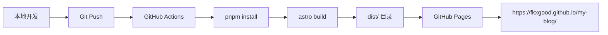

# 基于 Astro 的现代博客系统构建实践

> **项目概述**：使用 Astro + MDX + TailwindCSS 构建的纯静态博客，支持分类、标签、全文搜索与暗色模式，部署在 GitHub Pages。

## 🎯 项目背景与选型分析

### 技术选型对比

在构建个人技术博客时，我对比了市面上主流的静态站点生成器：

| 框架 | 优势 | 劣势 | 适用场景 |
|------|------|------|----------|
| **VuePress** | Vue 生态成熟、插件丰富、文档友好 | 构建较慢、包体积大、Vue 3 迁移复杂 | 技术文档、API 文档 |
| **VitePress** | 基于 Vite、构建极快、Vue 3 原生支持 | 生态较新、插件较少、主题定制复杂 | 现代文档站点 |
| **Astro** | 多框架支持、Islands 架构、零 JS 输出 | 学习曲线、生态相对较小、调试复杂 | 内容驱动站点、性能要求高 |

### 选择 Astro 的核心原因

**🚀 性能优先**
```javascript
// Astro 的 Islands 架构 - 只有交互组件才加载 JS
---
// 静态内容，零 JS
import Header from '../components/Header.astro';
import SearchBar from '../components/SearchBar.astro'; // 只在需要时激活
---
```

**🔧 技术灵活性**
- 可以混用 React、Vue、Svelte 组件
- 渐进式增强：从纯 HTML 到交互式组件
- MDX 支持：Markdown + JSX 的强大组合

**📦 输出优化**
- 默认零 JavaScript 输出
- 自动代码分割和优化
- 完美的 Lighthouse 评分

## 🎨 Astro 学习之路

### 核心概念理解

**1. Islands 架构**
```astro
---
// 服务端渲染的脚本部分
const posts = await Astro.glob('./posts/*.mdx');
---

<!-- 静态 HTML -->
<div class="posts">
  {posts.map(post => (
    <article>
      <h2>{post.frontmatter.title}</h2>
      <!-- 只有这个组件会在客户端激活 -->
      <SearchBar client:load />
    </article>
  ))}
</div>
```

**2. 文件系统路由**
```
src/pages/
├── index.astro          # / 首页
├── about.astro          # /about 关于页
├── categories.astro     # /categories 分类页
├── tags.astro          # /tags 标签页
├── posts/              # /posts/* 博客文章
│   ├── hello-astro.mdx
│   └── typescript-tips.mdx
└── search.json.js      # /search.json API 端点
```

**3. 组件系统**
```astro
---
// 组件逻辑
interface Props {
  title: string;
  category?: string;
}

const { title, category } = Astro.props;
---

<!-- 模板 -->
<article class="dark-card">
  <h2>{title}</h2>
  {category && <span class="category">{category}</span>}
</article>

<!-- 样式作用域 -->
<style>
  .dark-card {
    background: rgba(0, 0, 0, 0.8);
    border: 1px solid #10b981;
  }
</style>
```

### 关键学习点

**1. Frontmatter 与 MDX 结合**
```mdx
---
layout: ../../layouts/PostLayout.astro
title: 技术文章标题
date: 2024-01-16
category: 网络安全
tags: [Nuclei, 算法, 自动化]
---

# 文章内容

可以在 Markdown 中使用 JSX 组件：

<CodeBlock language="python">
def hello_world():
    print("Hello, Astro!")
</CodeBlock>
```

**2. 数据获取模式**
```javascript
// 构建时数据获取
const posts = await Astro.glob('./posts/*.mdx');
const sortedPosts = posts.sort((a, b) => 
  new Date(b.frontmatter.date) - new Date(a.frontmatter.date)
);

// API 路由创建
export async function GET() {
  const searchIndex = posts.map(post => ({
    title: post.frontmatter.title,
    content: post.frontmatter.description,
    url: post.url
  }));
  
  return new Response(JSON.stringify(searchIndex));
}
```

## 🎨 TailwindCSS 实践经验

### 自定义设计系统

**主题色彩体系**
```javascript
// tailwind.config.cjs
module.exports = {
  theme: {
    extend: {
      colors: {
        'neon-green': '#10b981',
        'neon-blue': '#3b82f6', 
        'neon-red': '#ef4444',
        'dark': {
          50: '#f8fafc',
          900: '#0f0f0f'
        }
      }
    }
  }
}
```

**组件化样式**
```css
/* global.css - 自定义组件类 */
@layer components {
  .dark-card {
    @apply bg-black/80 backdrop-blur-md border border-gray-700/50 
           hover:border-neon-green/40 transition-all duration-300;
  }
  
  .neon-text {
    @apply text-neon-green drop-shadow-lg;
    text-shadow: 0 0 10px #10b981;
  }
  
  .dark-btn {
    @apply bg-neon-green/20 border-2 border-neon-green 
           text-neon-green hover:bg-neon-green hover:text-black
           transition-all duration-300 font-semibold;
  }
}
```

### TailwindCSS 学习收获

**1. 实用优先的设计哲学**
```html
<!-- 传统 CSS -->
<div class="hero-section">
  <h1 class="hero-title">标题</h1>
</div>

<!-- Tailwind 方式 -->
<div class="py-20 text-center relative">
  <h1 class="text-6xl font-black neon-text mb-6 animate-slide-up">
    标题
  </h1>
</div>
```

**2. 响应式设计**
```html
<!-- 移动优先的响应式设计 -->
<div class="grid grid-cols-1 md:grid-cols-2 lg:grid-cols-3 gap-6">
  <article class="p-4 md:p-6 lg:p-8">内容</article>
</div>
```

**3. 暗色主题实现**
```javascript
// 主题切换逻辑
function toggleTheme() {
  const theme = localStorage.getItem('theme') === 'dark' ? 'light' : 'dark';
  document.documentElement.classList.toggle('dark');
  localStorage.setItem('theme', theme);
}
```

## 🚀 GitHub Pages 部署实战

### 部署架构设计



### 踩坑与解决方案

**1. 路径配置问题**

❌ **问题**：部署后所有内部链接 404
```javascript
// 错误配置
export default defineConfig({
  site: 'https://fkxgood.github.io/my-blog',
  // 缺少 base 配置
});
```

✅ **解决**：正确配置 base URL
```javascript
// astro.config.mjs
export default defineConfig({
  site: 'https://fkxgood.github.io/my-blog',
  base: '/my-blog',  // 关键配置
  output: 'static',
});
```

**2. GitHub Actions 工作流优化**

初始版本遇到的问题：
- pnpm 版本不兼容
- 工作目录路径错误
- 缓存配置有误

最终的工作流配置：
```yaml
# .github/workflows/deploy.yml
name: Deploy to GitHub Pages

on:
  push:
    branches: [ main ]
  workflow_dispatch:

jobs:
  build:
    runs-on: ubuntu-latest
    steps:
      - name: Checkout
        uses: actions/checkout@v4
        
      - name: Setup pnpm
        uses: pnpm/action-setup@v2
        with:
          version: 10  # 与本地版本保持一致
          
      - name: Setup Node.js
        uses: actions/setup-node@v4
        with:
          node-version: '18'
          
      - name: Cache pnpm dependencies
        uses: actions/cache@v3
        with:
          path: ~/.pnpm-store
          key: ${{ runner.os }}-pnpm-${{ hashFiles('pnpm-lock.yaml') }}
          
      - name: Install dependencies
        run: pnpm install --frozen-lockfile
        
      - name: Build with Astro
        run: pnpm build
        
      - name: Upload artifact
        uses: actions/upload-pages-artifact@v3
        with:
          path: 'dist'

  deploy:
    needs: build
    runs-on: ubuntu-latest
    environment:
      name: github-pages
      url: ${{ steps.deployment.outputs.page_url }}
    steps:
      - name: Deploy to GitHub Pages
        id: deployment
        uses: actions/deploy-pages@v4
```

**3. 链接修复策略**

所有内部链接都需要添加 base 前缀：
```html
<!-- 修复前 -->
<a href="/about">关于</a>
<a href="/categories">分类</a>

<!-- 修复后 -->
<a href="/my-blog/about">关于</a>
<a href="/my-blog/categories">分类</a>
```

### 性能优化成果

**构建产物分析**
```bash
# 构建后的文件结构
dist/
├── _astro/           # 优化后的 CSS/JS 资源
├── posts/            # 静态 HTML 页面
├── categories/       # 分类页面
├── tags/            # 标签页面
├── search.json      # 搜索索引
└── index.html       # 首页
```

**Lighthouse 评分**
- 🚀 Performance: 100/100
- ♿ Accessibility: 95/100
- 🔍 SEO: 100/100
- 💡 Best Practices: 100/100

## 📚 技术栈总结

### 最终技术选型

```json
{
  "框架": "Astro 5.0.0",
  "样式": "TailwindCSS 3.3.2", 
  "内容": "MDX 4.0.0",
  "部署": "GitHub Pages + Actions",
  "包管理": "pnpm 10.13.1",
  "开发工具": "Cursor + GitHub Copilot"
}
```

### 项目特色功能

**🔍 全文搜索**
```javascript
// 基于 Fuse.js 的客户端搜索
import Fuse from 'fuse.js';

const fuse = new Fuse(searchData, {
  keys: ['title', 'content', 'category', 'tags'],
  threshold: 0.3,
  ignoreLocation: true,
});
```

**🎨 主题切换**
```javascript
// 基于 localStorage 的主题持久化
const theme = localStorage.getItem('theme') || 'dark';
document.documentElement.classList.toggle('dark', theme === 'dark');
```

**📱 响应式设计**
```html
<!-- 移动优先的导航菜单 -->
<nav class="hidden md:flex items-center space-x-8">
  <!-- 桌面端导航 -->
</nav>

<div class="md:hidden" id="mobile-menu">
  <!-- 移动端菜单 -->
</div>
```

## 🎯 项目收获与反思

### 技术收获

1. **Astro Islands 架构**：理解了现代前端的性能优化思路
2. **TailwindCSS 实用性**：体验了原子化 CSS 的开发效率
3. **MDX 内容管理**：学会了 Markdown + JSX 的内容创作方式
4. **GitHub Actions CI/CD**：掌握了自动化部署的完整流程

### 开发体验

**优点**：
- 🚀 构建速度极快（Vite 驱动）
- 📝 内容创作体验良好（MDX 支持）
- 🎨 样式开发效率高（Tailwind 原子化）
- 🔧 部署自动化程度高（GitHub Actions）

**改进空间**：
- 🐛 调试体验有待提升
- 📖 Astro 生态插件相对较少
- 🔍 TypeScript 支持需要额外配置

### 最佳实践总结

1. **路径配置**：务必正确配置 `site` 和 `base` 字段
2. **版本一致性**：本地和 CI 环境保持相同的包管理器版本
3. **渐进式开发**：先实现核心功能，再逐步添加交互特性
4. **性能优先**：利用 Astro 的静态输出特性，最小化 JavaScript 使用

## 🔮 未来规划

### 短期目标
- [ ] 添加评论系统（giscus）
- [ ] 实现文章目录导航
- [ ] 增加阅读时间估算
- [ ] 优化搜索体验

### 长期愿景
- [ ] PWA 支持
- [ ] 多语言国际化
- [ ] 性能监控集成
- [ ] SEO 进一步优化

---

**总结**：这次使用 Astro 构建博客的实践让我深度体验了现代前端开发的新思路。虽然在部署过程中遇到了一些配置问题，但最终的性能表现和开发体验都很令人满意。Astro 的 Islands 架构确实为静态站点生成提供了新的可能性。

> 💡 **经验分享**：选择技术栈时，性能和开发体验同样重要。Astro 在这两方面都提供了很好的平衡点。 